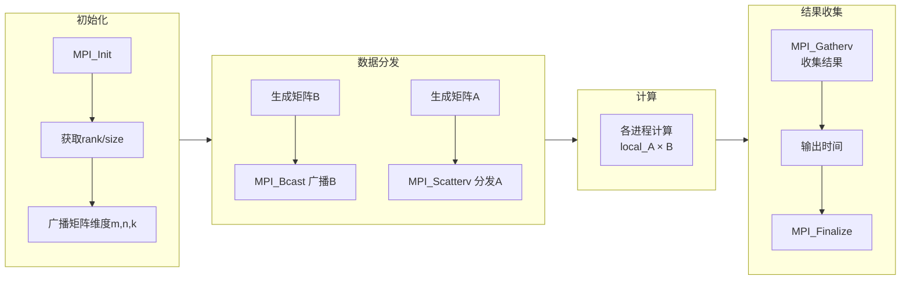

# 中山大学计算机院本科生实验报告

（2025学年春季学期）

课程名称：并行程序设计
批改人：

|实验| 使用MPI点对点通信方式实现并行通用矩阵乘法 |专业（方向）|计算机科学与技术 |
|---|---|---|---|
|学号|22336087 |姓名|胡瑞康 |
|Email|hurk3@mail2.sysu.edu.cn |完成日期|2025.3.19 |

## 代码介绍

本实验实现了基于 **MPI（Message Passing Interface）** 的 **并行矩阵乘法**，使用**点对点通信**方式对矩阵数据进行分发和收集，提升计算效率。

### **代码结构**
- **`main.cpp`**: 并行矩阵乘法的核心代码，利用 MPI 进行数据分发、计算与收集。
- **`evaluate.py`**: 用于自动化测试，执行不同进程数、不同矩阵规模的计算，并记录运行时间。

### **进程初始化**
```cpp
MPI_Init(&argc, &argv);
MPI_Comm_rank(MPI_COMM_WORLD, &rank);
MPI_Comm_size(MPI_COMM_WORLD, &size);
```
MPI 需要初始化环境，`MPI_Comm_rank` 获取当前进程的 **rank**（进程 ID），`MPI_Comm_size` 获取 MPI 进程的 **总数**，用于后续的任务划分。

### **矩阵 `A` 和 `B` 的初始化与广播**
```cpp
if (rank == 0) {
    B = (double*)malloc(n * k * sizeof(double));
    srand(time(NULL));
    for (int i = 0; i < n * k; i++) {
        B[i] = (double)(rand() % 10);
    }
}
MPI_Bcast(B, n * k, MPI_DOUBLE, 0, MPI_COMM_WORLD);
```
进程 0 **随机生成矩阵 B**，然后使用 **`MPI_Bcast`** 发送给所有进程，保证所有进程拥有完整的矩阵 `B`，避免不必要的重复计算。

### **矩阵 `A` 的分块与分发**
```cpp
MPI_Scatterv(A, send_counts, displs, MPI_DOUBLE, local_A, local_rows * n, MPI_DOUBLE, 0, MPI_COMM_WORLD);
```
矩阵 `A` 采用**行块划分**的方式进行数据分发，每个进程只计算一部分 `A`，`MPI_Scatterv` 允许数据**非均匀划分**，适用于 **行数无法整除进程数** 的情况。

### **并行计算矩阵乘法**
```cpp
for (int i = 0; i < local_rows; i++) {
    for (int j = 0; j < k; j++) {
        local_C[i * k + j] = 0.0;
        for (int l = 0; l < n; l++) {
            local_C[i * k + j] += local_A[i * n + l] * B[l * k + j];
        }
    }
}
```
每个进程计算自己负责的矩阵部分，标准三重循环的矩阵乘法计算方式不变，减少不必要的通信开销。

### **收集计算结果**
```cpp
MPI_Gatherv(local_C, local_rows * k, MPI_DOUBLE, C, send_counts, displs, MPI_DOUBLE, 0, MPI_COMM_WORLD);
```
`MPI_Gatherv` 负责将各个进程计算的 `local_C` 发送回主进程，`send_counts` 和 `displs` 控制数据传输，使得不同进程能够正确地合并计算结果。

### **计算执行时间**
```cpp
start = MPI_Wtime();
// 矩阵乘法计算
finish = MPI_Wtime();
double local_time = finish - start;
MPI_Reduce(&local_time, &max_time, 1, MPI_DOUBLE, MPI_MAX, 0, MPI_COMM_WORLD);
```
使用 `MPI_Wtime` 记录时间，计算每个进程的执行时间，并通过 `MPI_Reduce` 取所有进程的 **最大耗时** 作为最终计算时间。


### 整体架构图



## 运行测试

正常的编译，运行命令
```shell
export OMPI_ALLOW_RUN_AS_ROOT=1
export OMPI_ALLOW_RUN_AS_ROOT_CONFIRM=1
mpic++ main.cpp -o main
mpirun -np 4 ./main
```

为了方便测试结果记录，我写了`evaluate.py`脚本，用于自动输入与匹配运行时间并总结表格

```py
import subprocess
import re

# 编译 C++ 源码
compile_command = "mpic++ main.cpp -o main"
print("正在编译 C++ 程序...")
subprocess.run(compile_command, shell=True, check=True)

# 定义测试参数：进程数和矩阵规模（假设 m=n=k，即正方矩阵）
process_counts = [1, 2, 4, 8, 16]
matrix_sizes = [128, 256, 512, 1024, 2048]

# 用于存放测试结果，键为 (进程数, 矩阵规模)，值为耗时（秒）
results = {}

# 正则表达式模式，用于提取形如 "矩阵乘法计算耗时：0.123456 秒" 中的数字部分
pattern = re.compile(r"矩阵乘法计算耗时：([\d\.]+) 秒")

# 遍历所有组合进行测试
for p in process_counts:
    for size in matrix_sizes:
        # 构造输入：三个整数，均为矩阵规模（m, n, k）
        input_str = f"{size} {size} {size}\n"
        # --oversubscribe用来防止There are not enough slots available in the system to satisfy the 16 slots that were requested by the application
        command = f"mpirun --oversubscribe -np {p} ./main"
        print(f"\n运行测试：进程数 = {p}, 矩阵规模 = {size} x {size}")
        try:
            # 运行命令，同时传入输入字符串，捕获标准输出
            result = subprocess.run(command, input=input_str, text=True, shell=True, capture_output=True, check=True)
            output = result.stdout
            # 使用正则表达式匹配计算耗时
            match = pattern.search(output)
            if match:
                time_consumed = match.group(1)
            else:
                time_consumed = "N/A"
            results[(p, size)] = time_consumed
            print(f"测试结果：耗时 = {time_consumed} 秒")
        except subprocess.CalledProcessError as e:
            print(f"运行过程中发生错误：{e}")
            results[(p, size)] = "Error"

# 构造 Markdown 格式的结果表格
print("\n测试结果表格：\n")
header = "|进程数|"
for size in matrix_sizes:
    header += f"{size}|"
separator = "|" + " :-: |" * (len(matrix_sizes) + 1)
print(header)
print(separator)
for p in process_counts:
    row = f"|{p}|"
    for size in matrix_sizes:
        row += f"{results[(p, size)]}|"
    print(row)

```

## 结果展示

### 测试脚本结果
```shell
(base) root@GEM12PRO:/proj/ParallelProgramDesign/Lab/1# python evaluate.py
正在编译 C++ 程序...

运行测试：进程数 = 1, 矩阵规模 = 128 x 128
测试结果：耗时 = 0.011165 秒

运行测试：进程数 = 1, 矩阵规模 = 256 x 256
测试结果：耗时 = 0.095803 秒

运行测试：进程数 = 1, 矩阵规模 = 512 x 512
测试结果：耗时 = 0.811129 秒

运行测试：进程数 = 1, 矩阵规模 = 1024 x 1024
测试结果：耗时 = 8.876704 秒

运行测试：进程数 = 1, 矩阵规模 = 2048 x 2048
测试结果：耗时 = 83.334102 秒

运行测试：进程数 = 2, 矩阵规模 = 128 x 128
测试结果：耗时 = 0.006028 秒

运行测试：进程数 = 2, 矩阵规模 = 256 x 256
测试结果：耗时 = 0.047881 秒

运行测试：进程数 = 2, 矩阵规模 = 512 x 512
测试结果：耗时 = 0.461323 秒

运行测试：进程数 = 2, 矩阵规模 = 1024 x 1024
测试结果：耗时 = 4.411768 秒

运行测试：进程数 = 2, 矩阵规模 = 2048 x 2048
测试结果：耗时 = 32.099262 秒

运行测试：进程数 = 4, 矩阵规模 = 128 x 128
测试结果：耗时 = 0.002986 秒

运行测试：进程数 = 4, 矩阵规模 = 256 x 256
测试结果：耗时 = 0.028479 秒

运行测试：进程数 = 4, 矩阵规模 = 512 x 512
测试结果：耗时 = 0.250980 秒

运行测试：进程数 = 4, 矩阵规模 = 1024 x 1024
测试结果：耗时 = 2.319906 秒

运行测试：进程数 = 4, 矩阵规模 = 2048 x 2048
测试结果：耗时 = 16.596558 秒

运行测试：进程数 = 8, 矩阵规模 = 128 x 128
测试结果：耗时 = 0.001909 秒

运行测试：进程数 = 8, 矩阵规模 = 256 x 256
测试结果：耗时 = 0.017045 秒

运行测试：进程数 = 8, 矩阵规模 = 512 x 512
测试结果：耗时 = 0.142779 秒

运行测试：进程数 = 8, 矩阵规模 = 1024 x 1024
测试结果：耗时 = 1.239916 秒

运行测试：进程数 = 8, 矩阵规模 = 2048 x 2048
测试结果：耗时 = 9.548071 秒

运行测试：进程数 = 16, 矩阵规模 = 128 x 128
测试结果：耗时 = 0.001025 秒

运行测试：进程数 = 16, 矩阵规模 = 256 x 256
测试结果：耗时 = 0.011933 秒

运行测试：进程数 = 16, 矩阵规模 = 512 x 512
测试结果：耗时 = 0.136656 秒

运行测试：进程数 = 16, 矩阵规模 = 1024 x 1024
测试结果：耗时 = 0.859194 秒

运行测试：进程数 = 16, 矩阵规模 = 2048 x 2048
测试结果：耗时 = 6.677579 秒
```

### 表格总结

|进程数|128|256|512|1024|2048|
| :-: | :-: | :-: | :-: | :-: | :-: |
|1|0.011165|0.095803|0.811129|8.876704|83.334102|
|2|0.006028|0.047881|0.461323|4.411768|32.099262|
|4|0.002986|0.028479|0.250980|2.319906|16.596558|
|8|0.001909|0.017045|0.142779|1.239916|9.548071|
|16|0.001025|0.011933|0.136656|0.859194|6.677579|

### 表格分析

**计算时间随着进程数增加逐步减少**
   - 16 进程时，相比 1 进程，**计算加速比大幅提升**，但加速比随进程数增加逐步减小（**并行计算瓶颈**）。

**大规模矩阵计算加速更明显**
   - 2048×2048 矩阵从 **83.33s → 6.67s**，性能提高 **12 倍**。
   - 但 16 进程相较于 8 进程加速比下降，说明有 **通信开销瓶颈**。

## 优化方向讨论

### 在内存有限的情况下，如何进行大规模矩阵乘法计算？

**分块矩阵乘法 (Block Matrix Multiplication)**：

可以将大矩阵分割成若干个较小的子矩阵（或称为块）。

假设要计算 $C = A \times B$，可以将 $A$ 分割成 $A_{ij}$，将 $B$ 分割成 $B_{jk}$，那么 $C$ 中的每个块 $C_{ik}$ 可以通过以下公式计算：
$C_{ik} = \sum_{j} A_{ij} \times B_{jk}$

这样，每次只需要加载参与当前子块乘法和加法运算的几个小矩阵到内存中，计算完成后再将结果写回。

通过合理地选择块的大小，可以控制内存的使用量。

在并行计算中，不同的进程可以负责计算 $C$ 中不同的块，从而实现并行化。

---

**外存算法 (Out-of-Core Algorithms)**：

如果矩阵规模非常庞大，甚至连部分子块都无法完全放入内存时，需要考虑使用外存（如硬盘）。

外存算法会将部分数据存储在磁盘上，需要时再加载到内存中进行计算。这通常涉及到复杂的数据调度和缓存管理，以尽量减少磁盘 I/O 的开销，因为磁盘 I/O 的速度远低于内存访问。

例如，可以按行或列分批加载矩阵数据到内存中进行计算，并将中间结果写回磁盘，最后再合并得到最终结果。

---

### 如何提高大规模稀疏矩阵乘法性能？

**选择合适的稀疏矩阵存储格式：**

与稠密矩阵不同，稀疏矩阵通常只存储非零元素及其索引。

常见的存储格式包括：
- Coordinate List (COO)：存储 (行索引, 列索引, 值) 的三元组列表。简单直观，但不利于高效的算术运算。
- Compressed Sparse Row (CSR)：按行存储非零元素。使用三个数组：`values` 存储非零元素的值，`col_indices` 存储每个非零元素对应的列索引，`row_pointers` 存储每一行第一个非零元素在 `values` 和 `col_indices` 中的起始位置。CSR 格式非常适合按行进行的操作，例如矩阵-向量乘法。
- Compressed Sparse Column (CSC)：按列存储非零元素，与 CSR 类似，但按列组织。适合按列进行的操作。

在进行稀疏矩阵乘法时，选择合适的存储格式至关重要，它可以直接影响到算法的效率。

例如，计算 $C = A \times B$，如果 $A$ 是 CSR 格式，$B$ 是 CSC 格式，通常可以实现较高效的乘法。

---

**实现优化的稀疏矩阵乘法算法：**

传统的稠密矩阵乘法算法不适用于稀疏矩阵。需要设计专门针对稀疏矩阵的乘法算法，避免对零元素进行操作。

例如，在计算结果矩阵 $C$ 的某个元素 $C_{ij}$ 时，只需要考虑 $A$ 的第 $i$ 行和 $B$ 的第 $j$ 列中非零元素对应的位置。只有当 $A_{ik} \neq 0$ 且 $B_{kj} \neq 0$ 时，乘积才可能非零。

算法通常会遍历第一个矩阵的非零元素，并在第二个矩阵中查找相应的非零元素进行计算。