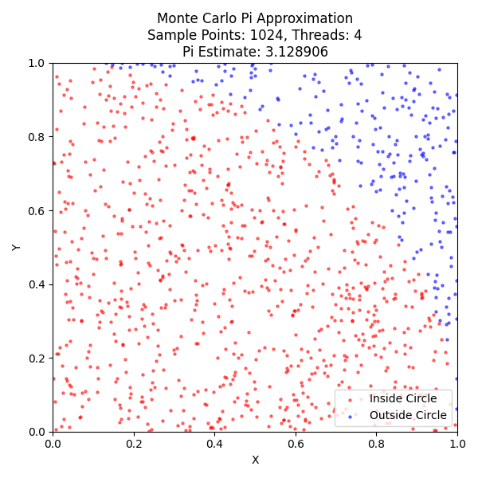
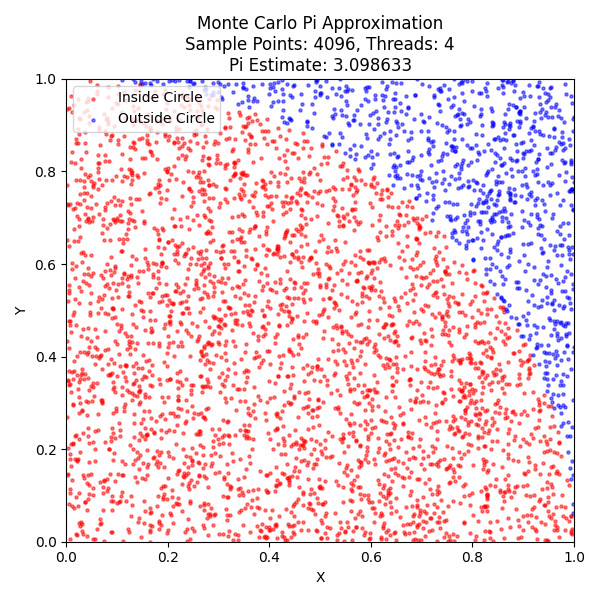
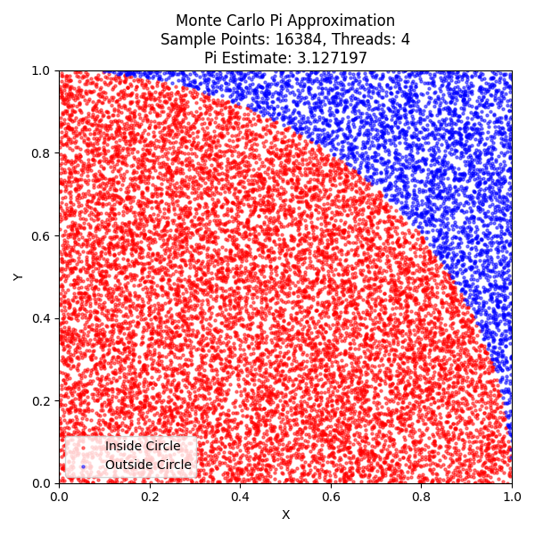
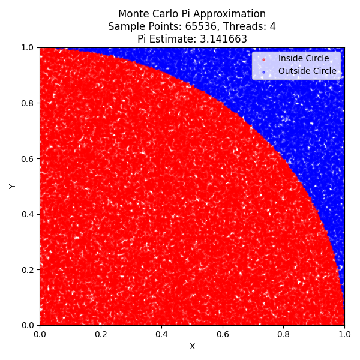

# 中山大学计算机院本科生实验报告

（2025学年春季学期）

课程名称：并行程序设计
批改人：

|实验| 4-Pthreads并行方程求解及蒙特卡洛 |专业（方向）|计算机科学与技术 |
|---|-------------------------------|-----------|---------------|
|学号|22336087 |姓名|胡瑞康 |
|Email|hurk3@mail2.sysu.edu.cn |完成日期|2025.4.2 |

## 并行求解方程

本实验基于 Pthreads 实现了二次方程求解程序，提供了顺序版和并行版（基本版）的两种实现方案。实验对比了两种方法在不同二次方程系数输入下的运行耗时，并通过自动化测试脚本进行数据采集。本文档将详细介绍代码实现、运行测试过程、结果表格以及对比分析。

### 代码介绍

#### 公共部分

两个版本均采用标准输入方式获取一元二次方程系数 `a, b, c`，同时检查 `a` 是否为 0 以确保输入的是有效的二次方程。整个程序均使用 `clock_gettime` 函数统计解题耗时，以便精确测量各阶段运行时间。

#### 顺序执行版本

顺序版实现于文件 `quadratic_sequential.cpp`

```cpp
#include <stdio.h>
#include <stdlib.h>
#include <time.h>
#include <math.h>

int main() {
    double a, b, c;  // 一元二次方程的系数

    printf("请输入一元二次方程 ax² + bx + c = 0 的系数 a, b, c：\n");
    if (scanf("%lf %lf %lf", &a, &b, &c) != 3) {
        printf("输入格式错误！\n");
        return 1;
    }

    // 检查a是否为0（如果a=0，则不是一元二次方程）
    if (a == 0) {
        printf("错误：a不能为0（不是一元二次方程）\n");
        return 1;
    }

    struct timespec start, end;
    clock_gettime(CLOCK_MONOTONIC, &start);

    // 计算判别式
    double discriminant = b * b - 4 * a * c;

    // 计算根
    double x1, x2;

    if (discriminant >= 0) {
        x1 = (-b + sqrt(discriminant)) / (2 * a);
        x2 = (-b - sqrt(discriminant)) / (2 * a);
    }

    clock_gettime(CLOCK_MONOTONIC, &end);
    double time_consumed = (end.tv_sec - start.tv_sec) + (end.tv_nsec - start.tv_nsec) / 1e9;

    // 输出结果
    printf("\n方程 %.2fx² + %.2fx + %.2f = 0\n", a, b, c);

    if (discriminant > 0) {
        printf("有两个不同的实根：\n");
        printf("x1 = %.6f\n", x1);
        printf("x2 = %.6f\n", x2);
    } else if (discriminant == 0) {
        printf("有一个二重实根：\n");
        printf("x1 = x2 = %.6f\n", x1);
    } else {
        // 复数根的情况
        double real_part = -b / (2 * a);
        double imag_part = sqrt(-discriminant) / (2 * a);
        printf("有两个共轭复根：\n");
        printf("x1 = %.6f + %.6fi\n", real_part, imag_part);
        printf("x2 = %.6f - %.6fi\n", real_part, imag_part);
    }

    printf("\n求解耗时：%.9f 秒\n", time_consumed);

    return 0;
}
```

**代码解释：**

- **输入与检查**
  通过 `scanf` 读取用户输入的系数，并判断输入格式是否正确，同时检查 `a` 是否为 0，保证是合法的二次方程。

- **时间统计**
  使用 `clock_gettime` 记录程序开始和结束时间，精确计算求解过程的耗时。

- **判别式及根的计算**
  根据公式 $ \Delta = b^2 - 4ac $ 判断根的情况：
  - 当 $\Delta>0$ 时，调用 `sqrt` 得到正平方根，并计算两个不同实根；
  - 当 $\Delta=0$ 时，输出一个二重根；
  - 当 $\Delta<0$ 时，通过计算复数部分得到共轭复根。

- **结果输出**
  将计算得到的根和求解耗时输出到终端，方便验证正确性和性能比较。

#### 基本版（Pthreads）

并行版的关键在于通过线程并行计算部分中间结果，以期减少总运行时间。整个程序的结构与顺序版类似，但在以下几个地方做了改进：

#### 线程函数及共享变量

程序通过全局变量存储部分计算结果，并用互斥锁及条件变量同步线程：

```cpp
// 全局变量用于共享中间计算结果及同步标志
double g_b2 = 0.0;       // 存储 b² 的计算结果
double g_fourac = 0.0;   // 存储 4ac 的计算结果
double g_sqrtD = 0.0;    // 存储 sqrt(D) 的计算结果

int done_b2 = 0;       // 标志 b² 的计算是否完成
int done_fourac = 0;   // 标志 4ac 的计算是否完成
int done_sqrt = 0;     // 标志 sqrt(D) 的计算是否完成

// 初始化同步互斥锁和条件变量
pthread_mutex_t mutex = PTHREAD_MUTEX_INITIALIZER;
pthread_cond_t cond = PTHREAD_COND_INITIALIZER;
```

#### 分工计算

利用三个线程分别完成以下任务：
- **计算 b²**
  线程函数 `compute_b2` 用于计算 $ b^2 $ 并将结果存入全局变量，同时设置标志 `done_b2`。

  ```cpp
  void* compute_b2(void* arg) {
      double b = *(double*)arg;
      double temp = b * b;

      pthread_mutex_lock(&mutex);
      g_b2 = temp;
      done_b2 = 1;
      pthread_cond_signal(&cond);
      pthread_mutex_unlock(&mutex);
      return NULL;
  }
  ```

- **计算 4ac**
  线程函数 `compute_fourac` 通过传入的数组参数计算 $ 4ac $，更新全局变量 `g_fourac`。

  ```cpp
  void* compute_fourac(void* arg) {
      double* coeffs = (double*)arg; // coeffs[0] = a, coeffs[1] = c
      double temp = 4 * coeffs[0] * coeffs[1];

      pthread_mutex_lock(&mutex);
      g_fourac = temp;
      done_fourac = 1;
      pthread_cond_signal(&cond);
      pthread_mutex_unlock(&mutex);
      return NULL;
  }
  ```

- **计算 sqrt(D)**
  如果判别式 $ D = b^2 - 4ac $ 大于等于 0，则启动线程 `compute_sqrt` 来计算 $ \sqrt{D} $。

  ```cpp
  void* compute_sqrt(void* arg) {
      double D = *(double*)arg;
      double temp = sqrt(D);

      pthread_mutex_lock(&mutex);
      g_sqrtD = temp;
      done_sqrt = 1;
      pthread_cond_signal(&cond);
      pthread_mutex_unlock(&mutex);
      return NULL;
  }
  ```

#### 主函数流程

主函数中先启动计算 $ b^2 $ 和 $ 4ac $ 的线程，等待它们计算完成后再计算判别式，并根据判别式大小决定是否创建计算 $ \sqrt{D} $ 的线程：

```cpp
int main() {
    double a, b, c;
    printf("请输入一元二次方程 ax² + bx + c = 0 的系数 a, b, c：\n");
    if (scanf("%lf %lf %lf", &a, &b, &c) != 3) {
        printf("输入格式错误！\n");
        return EXIT_FAILURE;
    }
    if (a == 0) {
        printf("错误：a 不能为 0（这不是一元二次方程）\n");
        return EXIT_FAILURE;
    }

    struct timespec start, end;
    clock_gettime(CLOCK_MONOTONIC, &start);

    pthread_t thread_b2, thread_fourac, thread_sqrt;

    // 启动线程计算 b²，注意传入 b 的地址
    double b_copy = b; // 为防止直接传入全局变量产生竞争，这里复制一份
    if (pthread_create(&thread_b2, NULL, compute_b2, &b_copy) != 0) {
        perror("创建计算 b² 的线程失败");
        exit(EXIT_FAILURE);
    }

    // 启动线程计算 4ac，传入包含 a 和 c 的数组
    double ac_args[2] = {a, c};
    if (pthread_create(&thread_fourac, NULL, compute_fourac, ac_args) != 0) {
        perror("创建计算 4ac 的线程失败");
        exit(EXIT_FAILURE);
    }

    // 主线程等待 b² 和 4ac 计算完成
    pthread_mutex_lock(&mutex);
    while (!(done_b2 && done_fourac)) {
        pthread_cond_wait(&cond, &mutex);
    }
    pthread_mutex_unlock(&mutex);

    // 计算判别式 D
    double D = g_b2 - g_fourac;

    // 若 D >= 0，启动线程计算 sqrt(D)
    if (D >= 0) {
        if (pthread_create(&thread_sqrt, NULL, compute_sqrt, &D) != 0) {
            perror("创建计算 sqrt(D) 的线程失败");
            exit(EXIT_FAILURE);
        }
        pthread_mutex_lock(&mutex);
        while (!done_sqrt) {
            pthread_cond_wait(&cond, &mutex);
        }
        pthread_mutex_unlock(&mutex);
        pthread_join(thread_sqrt, NULL);
    }

    // 等待之前启动的线程结束
    pthread_join(thread_b2, NULL);
    pthread_join(thread_fourac, NULL);

    // 根据判别式判断根的情况并计算根值
    double x1, x2;
    if (D > 0) { // 两个不同的实根
        x1 = (-b + g_sqrtD) / (2 * a);
        x2 = (-b - g_sqrtD) / (2 * a);
    } else if (D == 0) { // 一个二重实根
        x1 = x2 = -b / (2 * a);
    }

    clock_gettime(CLOCK_MONOTONIC, &end);
    double time_consumed = (end.tv_sec - start.tv_sec) + (end.tv_nsec - start.tv_nsec) / 1e9;

    // 输出结果
    printf("\n方程 %.2fx² + %.2fx + %.2f = 0\n", a, b, c);
    if (D > 0) {
        printf("有两个不同的实根：\n");
        printf("x1 = %.6f\n", x1);
        printf("x2 = %.6f\n", x2);
    } else if (D == 0) {
        printf("有一个二重实根：\n");
        printf("x = %.6f\n", x1);
    } else { // D < 0，输出共轭复根
        double real_part = -b / (2 * a);
        double imag_part = sqrt(-D) / (2 * a);
        printf("有两个共轭复根：\n");
        printf("x1 = %.6f + %.6fi\n", real_part, imag_part);
        printf("x2 = %.6f - %.6fi\n", real_part, imag_part);
    }

    printf("\n求解耗时：%.9f 秒\n", time_consumed);

    return EXIT_SUCCESS;
}
```

**代码解释：**

- **线程创建与同步**
  主线程依次启动两个线程计算 $b^2$ 和 $4ac$ 后，利用条件变量等待这两个线程完成计算，再计算判别式 $D$；如果 $D \geq 0$，再启动计算 $ \sqrt{D} $ 的线程。

- **互斥锁与条件变量**
  整个过程通过 `pthread_mutex_lock`/`unlock` 和 `pthread_cond_wait`/`pthread_cond_signal` 保证多线程之间数据访问的安全和正确同步。

- **最终根的计算和输出**
  根据 $D$ 的不同情况，按公式计算根值，并输出计算结果及总体求解耗时。


### 运行测试

为了客观对比两种实现方式的性能，测试脚本 `evaluate.py` 实现了以下主要功能：

1. **随机生成二次方程组合**
   根据不同根类型（双重根、两个不同实根、共轭复根）随机生成二次方程的系数，确保生成的系数满足判别式条件。
   例如，生成双重根时会确保 $ b^2 = 4ac $（见代码片段）：
   ```python
   # 对于二重根，b^2 = 4ac ；通过选择b，计算c的值
   b = random.uniform(-999999, 999999)
   c = (b**2) / (4 * a)
   ```

2. **自动编译与执行**
   分别对顺序版（`quadratic_sequential.cpp`）和并行版（`quadratic_pthread.cpp`）源码进行编译，并对每组系数多次执行测试，将各次的耗时数据记录下来。
   通过正则表达式匹配输出中的“求解耗时”信息，提取出耗时数据。

3. **结果统计与性能比较**
   脚本统计每组测试的平均耗时和标准差，并最后输出一个比较表格，显示顺序版与基本版的运行时间以及基本版相对顺序版的性能比（当顺序版耗时为 0 时，显示 N/A）。

部分关键代码如下：

```python
# 使用正则表达式匹配输出中的耗时信息
pattern = re.compile(r"求解耗时：([\d\.]+) 秒")

# 运行测试：对每组系数进行多次测试，并统计平均时间和标准差
for coef_idx, (a, b, c) in enumerate(config['coefficients']):
    times = []
    for run in range(num_runs):
        input_str = f"{a} {b} {c}\n"
        command = f"./{config['binary']}"
        result = subprocess.run(command, input=input_str,
                                text=True, shell=True,
                                capture_output=True, check=True)
        match = pattern.search(result.stdout)
        if match:
            time_consumed = float(match.group(1))
            times.append(time_consumed)
    # 计算平均耗时和标准差
    avg_time = statistics.mean(times)
    std_time = statistics.stdev(times) if len(times) > 1 else 0.0
    config['results'][(a, b, c)] = (avg_time, std_time)
```

**脚本说明：**

- **随机系数生成**
  代码中调用 `generate_random_equation` 函数生成10个二次方程测试组合，包含3个双重根、4个两个不同实根和3个复根方程。

- **自动化编译**
  根据配置字典中各程序的源码文件名和生成的可执行文件名，脚本自动编译两个版本。

- **结果输出**
  测试结果通过打印表格展示，最后输出一个对比表格，直接比较同一系数组合下两种实现方式的平均耗时以及性能比。


### 表格展示

|方程系数 (a, b, c)|顺序版耗时|基本版耗时|基本版耗时/顺序版耗时|
| :--- | ---: | ---: | ---: |
|(826668.141912, -464304.316392, 65194.696221)|0.000000591|0.000284133|480.60|
|(385983.433131, 83521.268969, 4518.256381)|0.000000064|0.000156124|2439.44|
|(903722.868116, 274259.784423, 20807.935708)|0.000000595|0.000297076|498.95|
|(363032.472730, 364380.096232, 91433.180572)|0.000000066|0.000170955|2590.23|
|(225960.759234, -626237.973503, 433895.382539)|0.000000735|0.000265106|360.59|
|(471079.508430, -515577.198817, 141069.060106)|0.000000573|0.000321770|561.36|
|(154419.127400, 668360.784943, 723203.892711)|0.000001314|0.000372604|283.52|
|(751280.829261, -46114.419909, 707.638090)|0.000000076|0.000228698|3001.28|
|(353284.584679, 55828.542679, 2206.187832)|0.000000062|0.000222080|3581.94|
|(506997.042330, 40420.035571, 805.998437)|0.000000080|0.000187383|2342.28|

### 表格分析

从表格数据可以看出，基本版的耗时远高于顺序版，这表明在当前的二次方程求解场景下，并行计算所引入的线程创建、同步等开销远超过了并行计算带来的优势。

尽管并行计算的初衷是通过多线程同时处理部分任务来提升性能，但在这种简单的二次方程求解任务中，由于计算量本身较小，并行化所带来的额外开销占据了主导地位，使得并行版的效率大幅降低。


## 蒙特卡洛方法求圆周率近似值


### 背景知识

蒙特卡洛方法在估算圆周率时的核心思想是利用几何概率。在单位正方形内均匀随机撒点，统计这些点中有多少落在内切圆内。设采样点总数为 $N$，其中落在圆内的点为 $M$，则根据概率理论，点落入圆内的概率约为 $\frac{M}{N} \approx \frac{\pi r^2}{(2r)^2} = \frac{\pi}{4}$，从而可以近似得出：
$$
\pi \approx 4 \times \frac{M}{N}
$$

### 代码介绍

实验程序由 `montecarlo_pthread.cpp` 编写，整体采用如下结构：

- **输入参数**：从命令行接收两个参数：采样点数 `total_points` 与线程数 `thread_count`；
- **线程并行处理**：程序创建 `thread_count` 个线程，每个线程独立执行采样与判定圆内点的任务，局部计数后通过互斥锁汇总至全局变量；
- **文件输出**：每个线程将采样点的坐标和落点信息批量写入文件 `montecarlo_points.txt`，为后续可视化提供数据支持；
- **输出结果**：程序在终端输出估算的 $\pi$ 值、圆内点个数、总采样数与总执行时间。

线程之间通过结构体 `ThreadData` 传递线程ID信息，通过 `pthread_mutex_t` 保证全局共享数据与文件写入的同步安全。

### **线程函数定义与局部缓冲区策略**

```cpp
void* montecarlo_thread(void* arg) {
    ThreadData* data = (ThreadData*)arg;
    int tid = data->tid;
    unsigned int seed = (unsigned int)time(NULL) ^ (tid * 131542391);
    ...
    const int BUFFER_SIZE = 1000;
    double x_buffer[BUFFER_SIZE];
    double y_buffer[BUFFER_SIZE];
    int in_circle_buffer[BUFFER_SIZE];
    int buffer_count = 0;
    ...
}
```

**代码解释：**

- 每个线程都通过 `ThreadData` 结构体传入自己的 `tid`。
- 使用 `rand_r(&seed)` 生成线程安全的伪随机数，结合线程ID初始化种子，避免多个线程使用相同的种子造成重复采样。
- 设置局部缓冲区 `BUFFER_SIZE = 1000`，用于减少频繁的文件写操作，提升性能。
- `x_buffer` / `y_buffer` 存储坐标，`in_circle_buffer` 存储是否落入圆内的标志（1或0）。

---

### **点的采样与判定是否在圆内**

```cpp
double x = (double)rand_r(&seed) / (double)RAND_MAX;
double y = (double)rand_r(&seed) / (double)RAND_MAX;
int in_c = is_in_circle(x, y);
```

**代码解释：**

- 利用 `rand_r` 生成 `[0,1)` 区间内的随机点 `(x, y)`。
- 调用 `is_in_circle` 函数判断点是否落在单位圆内（原点为圆心，半径为1）。
- `is_in_circle` 实现简单，通过判断 `x² + y² <= 1` 来返回布尔结果。

---

### **批量写入文件输出**

```cpp
if (buffer_count == BUFFER_SIZE || i == points_per_thread - 1) {
    pthread_mutex_lock(&mutex);
    for (int j = 0; j < buffer_count; j++) {
        fprintf(fp_out, "%.6f %.6f %d\n", x_buffer[j], y_buffer[j], in_circle_buffer[j]);
    }
    pthread_mutex_unlock(&mutex);
    buffer_count = 0;
}
```

**代码解释：**

- 每采样1000个点或采样结束后，线程使用互斥锁 `mutex` 执行批量写入。
- 写入格式为：x坐标 y坐标 是否在圆内（1或0），方便后续绘图。
- 写完后清空缓冲区，继续采样新的点。

---

### **汇总圆内点计数**

```cpp
pthread_mutex_lock(&mutex);
circle_count_global += local_in_circle;
pthread_mutex_unlock(&mutex);
```

**代码解释：**

- 每个线程维护自己的 `local_in_circle`，最终使用互斥锁同步地将本地统计值累加到全局变量 `circle_count_global`。
- 保证多线程并发写入全局变量时不会产生竞态条件（数据竞争）。

---

### **主函数中的 π 值估算与输出**

```cpp
double pi_est = 4.0 * (double)circle_count_global / (double)total_points;
printf("估算的pi值: %.6f\n", pi_est);
printf("求解耗时: %.6f 秒\n", time_consumed);
```

**代码解释：**

- 根据蒙特卡洛方法公式 $\pi \approx 4 \times \frac{M}{N}$ 计算近似值。
- 其中 `M` 为所有线程采样过程中落入圆内的点数，`N` 为总采样点数。
- 输出估算的 π 值与程序整体运行耗时，便于评估性能与准确性。


### 运行测试


实验使用自动化脚本 `plot_montecarlo.py` 进行程序编译、不同线程与采样点数的组合运行，并记录结果。

- **自动编译程序**：脚本首先检查源文件是否存在，调用 `g++` 进行带 `-pthread` 参数的编译，生成可执行文件 `montecarlo_pthread`。

- **执行与数据采集**：针对预设的采样点数量（如 1024、4096、16384、65536）和线程数（2、4、8）进行组合测试。每次运行程序后，从标准输出中提取估算的 π 值和执行耗时，记录到结果列表。

- **生成可视化图像**：当线程数为 4 时，自动读取 `montecarlo_points.txt` 中的坐标数据，并生成散点图，直观展示落在圆内与圆外的点分布。

- **输出 Markdown 表格**：脚本将所有测试结果整理为 Markdown 格式表格，显示各配置下的 π 估计值与运行时间，并自动保存为 `montecarlo_results.md` 文件，便于报告嵌入与复用。


### 结果展示






| 采样点数 | 线程数 | Pi估计值 | 执行时间 (s) |
| ------------ | ----------- | ----------- | ------------------ |
| 1024 | 2 | 3.144531 | 0.000898 |
| 1024 | 4 | 3.128906 | 0.001321 |
| 1024 | 8 | 3.183594 | 0.002302 |
| 4096 | 2 | 3.127930 | 0.002512 |
| 4096 | 4 | 3.098633 | 0.002383 |
| 4096 | 8 | 3.127930 | 0.005343 |
| 16384 | 2 | 3.134521 | 0.006373 |
| 16384 | 4 | 3.127197 | 0.007845 |
| 16384 | 8 | 3.125488 | 0.009047 |
| 65536 | 2 | 3.132202 | 0.027960 |
| 65536 | 4 | 3.141663 | 0.027266 |
| 65536 | 8 | 3.149658 | 0.027692 |


### 结果分析

从实验数据可以看出以下几点：

1. **准确性逐渐提升**：随着采样点数增加，估算出的圆周率值趋于稳定，误差明显减小；
2. **线程数对运行时间影响不稳定**：在线程数较小时（如2、4），计算时间略有下降；但线程数进一步增加（如8线程）后，部分情况下程序反而变慢；
3. **同步与线程创建开销**：线程数增多带来的性能提升受到同步锁、线程上下文切换等开销的影响，在采样点较少时尤其明显。
